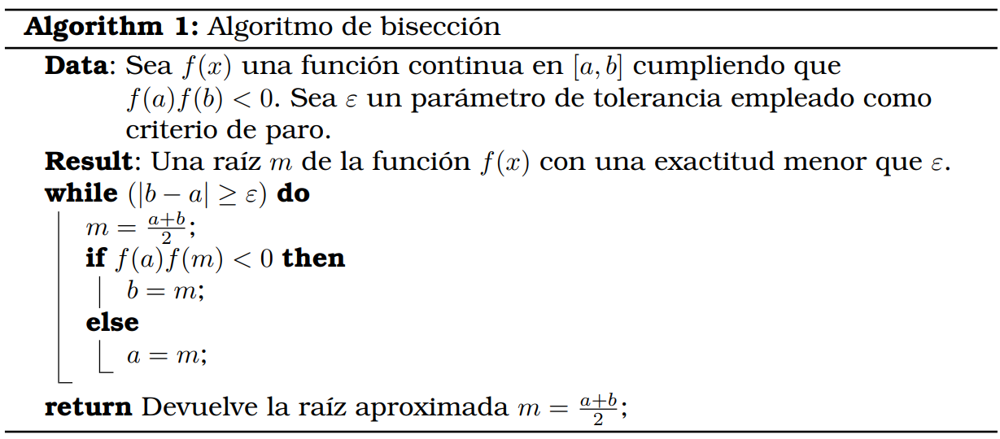

El método de la bisección es un procedimiento para calcular una raíz de la función $f(x)$, esto es, resolver la ecuación $f(x) = 0$. Este procedimiento asume que la función es continua en un intervalo $[a, b]$ y que la función cambia de signo en los extremos del intervalo $(f(a)f(b) < 0)$.

En cada iteración calcula el punto medio del intervalo actual y decide cual de los dos subintervalos sigue conteniendo una raíz eligiendo este subintervalo como el nuevo intervalo de la iteración siguiente. Cada vez que aplica una iteración la longitud del intervalo inicial se reduce a la mitad y tras $n$ iteraciones tenemos que

$$
\ell_n = \frac{\ell_0}{2^n}
$$

donde $\ell_0$ es la longitud del intervalo incial y $\ell_n$ es el intervalo tras realizar la $n$−ésima iteración. El siguiente pseudocodigo implementa el siguiente algoritmo.

# Algoritmo de bisección

# Implementación del algoritmo en Matlab

## Versión 1
Implementa el algoritmo para una función determinada $f(x) = ln x$ y en un intervalo genérico $[a, b]$ y precisión $\varepsilon$. Debe devolver la raíz $m$.

Esta primera versión es la implementación del algoritmo. Pedimos por teclado el intervalo $[a,b]$ y la precisión o tolerancia. Después, mostramos por pantalla la raíz pedida de la función logaritmo.

[Script en Matlab de la solución](/bisection/biseccionv1.m)
## Versión 2
Añade que compruebe la hipótesis $f(a)f(b) < 0$, que devuelva los distintos intervalos obtenidos, puntos medios y valor de la fución en dichos puntos medios. La función Matlab también debe devolver la gráfica de la función para comprobar si es continua.

Para esta segunda versión, hemos añadido un vector de cuatro elementos, donde se almacenará el intervalo final, la raíz y la función en la raíz, para mostrarlo más tarde. 
También se ha añadido un condicional que compruebe que $f(a) * f(b) < 0$, para que, en caso negativo, el programa dé error y evitar problemas.

Por último, también se ha añadido una función para graficar f(x). Las líneas 29 a 32 se encargan de quitar los bordes y colocar los ejes X e Y, para conseguir una mejora estética; no obstante, el programa puede funcionar sin ellas.

[Script en Matlab de la solución](/bisection/biseccionv2.m)
## Versión 3
Modificar la anterior versión de tal forma que la función pueda ser genérica. Testea
el programa con los ejemplos
- $f_1(x) = x \ln~x$
- $f_2(x) = x − 2^{−x}$
- $f_3(x) = e ^{−x} + \sin x$
- $f_4(x) = e^x − x^2 + 3x − 2$

Para poder recoger la función como input, reestructuramos el programa, estableciendo el script como una <b>function</b>, donde los argumentos serán: a,b,épsilon y la función f(x). 
 
También hemos modificado el vector, que ahora es una tabla donde también se recogerán las interacciones. De nuevo, las líneas 35 a 38 tienen una finalidad estética; el programa puede funcionar sin ellas.

[Script en Matlab de la solución](/bisection/biseccionv3.m)